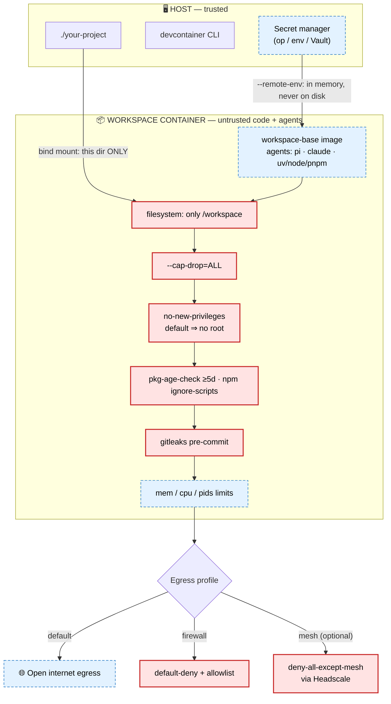

# dev-workspaces

Spin up **safe, isolated dev containers** for any project — with coding agents
([pi](https://github.com/earendil-works/pi-coding-agent) and
[Claude Code](https://github.com/anthropics/claude-code)) preinstalled,
supply-chain guardrails on by default, and one-file egress firewalling.

One workspace = one project directory, running as a persistent container.
Terminal-first via the [`devcontainers/cli`](https://github.com/devcontainers/cli),
and compatible with VS Code "Reopen in Container" since it's just a standard
`devcontainer.json`.

## What you get

- **Agents preloaded:** `pi` and `claude` are baked into the base image.
- **Batteries-included shell:** ripgrep, fd, bat, fzf, jq, tree, git, starship,
  just — plus `uv` (Python), `nvm`/Node/`pnpm` (Node).
- **Isolation:** only the project directory is mounted. The default profile is
  maximally locked — `--cap-drop=ALL` + `no-new-privileges`, so there is **no
  in-container root** (sudo/apt are intentionally non-functional; install deps
  with uv/pnpm). Plus memory/CPU/pid limits.
- **Supply-chain guards:** `npm`/`pnpm`/`uv add` refuse packages published in
  the last 5 days; npm `ignore-scripts` is forced on; a `gitleaks` pre-commit
  hook blocks secret commits.
- **Persistent caches:** per-workspace volumes for uv/npm/pnpm/bun so rebuilds
  are fast and never shared across projects.
- **Opt-in egress firewall:** default-deny outbound with an editable allowlist.

## Architecture

> **Legend:** 🔒 = enforced safety boundary (loosening it reduces isolation —
> change only deliberately) · ⚙ = customization point (safe to tune per project).

The host is trusted; the container is where untrusted code and agents run. The
container boundary plus a stack of enforced controls is what keeps that code
contained. Egress is the one part that changes per **profile**.

```text
 LEGEND   🔒 enforced safety boundary        ⚙ customizable knob

┌──────────────────────────────────────────────────────────────────────┐
│ HOST  (trusted)                                                        │
│                                                                        │
│   secret manager (op / env / Vault)            ⚙ bring your own        │
│        │  resolves KEY=value on the host                               │
│        │  passed via --remote-env → in memory only, never on disk      │
│   devcontainer CLI                                                     │
│   ./your-project ──────────────┐  (only this directory is mounted)     │
└────────────────────────────────┼──────────────────────────────────────┘
                                  │
         ═══════════ CONTAINER BOUNDARY 🔒 ═══════════
┌────────────────────────────────▼──────────────────────────────────────┐
│ WORKSPACE CONTAINER  (runs untrusted code + agents)                    │
│                                                                        │
│  image: workspace-base — reproducible, built once   ⚙ extend via FROM  │
│  agents: pi · claude      tooling: uv · node · pnpm · ripgrep · …       │
│                                                                        │
│  🔒 filesystem : only ./your-project is visible at /workspace          │
│  🔒 caps       : --cap-drop=ALL                                        │
│  🔒 privilege  : no-new-privileges  (default profile ⇒ no root / apt)  │
│  🔒 supply     : pkg-age-check ≥5d (⚙ threshold) · npm ignore-scripts  │
│  🔒 commits    : gitleaks pre-commit hook                              │
│  ⚙  limits     : --memory · --cpus · --pids-limit                      │
└────────────────────────────────┬───────────────────────────────────────┘
                                  │  EGRESS — depends on the chosen profile
        ┌─────────────────────────┼─────────────────────────────┐
        ▼                         ▼                             ▼
  ┌────────────┐         ┌────────────────────┐       ┌─────────────────────┐
  │ DEFAULT    │         │ FIREWALL           │       │ MESH (optional)     │
  │ open       │         │ 🔒 default-deny     │       │ 🔒 deny-all-except- │
  │ internet   │         │    + allowlist ⚙    │       │    mesh             │
  │ egress     │         │ (npm,pypi,gh,+yours)│       │ via Headscale ⚙     │
  └────────────┘         └────────────────────┘       └─────────────────────┘
   least setup            controlled egress             egress containment
```

The same picture as a Mermaid diagram (renders on GitHub):



In both diagrams, **red / 🔒 nodes are the safety boundary** (mount isolation,
dropped capabilities, no-privilege-escalation, supply-chain and secret-leak
guards, and — in the firewall/mesh profiles — egress restriction). **Blue /
dashed / ⚙ nodes are yours to customize.** The default profile is the most
locked down (no in-container root); the firewall and mesh profiles deliberately
relax capabilities to enforce egress control instead (see
[Egress firewall](#egress-firewall-opt-in) and the Mesh notes).

### Configuration reference

| Knob | Where | Default | Safety-sensitive? |
|---|---|---|---|
| Project mount | `workspaceMount` | the project dir only | 🔒 don't widen |
| Capabilities | `runArgs` `--cap-drop` | `ALL` (default profile) | 🔒 keep dropped |
| Privilege escalation | `runArgs` `no-new-privileges` | on (default profile) | 🔒 keep on |
| Resource limits | `runArgs` `--memory`/`--cpus`/`--pids-limit` | 4g / 2 / 2048 | ⚙ tune freely |
| Package age rule | `PKG_MIN_AGE_DAYS` env | 5 days | ⚙ lowering weakens supply-chain |
| npm install scripts | `NPM_CONFIG_IGNORE_SCRIPTS` | `true` | 🔒 keep on |
| Extra tools / deps | custom image `FROM workspace-base:latest` | — | ⚙ |
| Prompt / dotfiles | bind `starship.toml` or `--dotfiles-repository` | minimal | ⚙ |
| Egress allowlist | `.devcontainer/firewall/allowlist` | npm · PyPI · GitHub | ⚙ firewall profile |
| Mesh join | `TS_AUTHKEY` (+ `TS_LOGIN_SERVER` for Headscale), via `--remote-env` | — | ⚙ mesh profile |
| Mesh egress containment | `mesh-firewall` (+ `TS_CONTROL_HOSTS`) | off | 🔒 mesh profile |

## Prerequisites

- Docker
- Node.js (for the devcontainer CLI)

```bash
npm install -g @devcontainers/cli
```

## Setup

```bash
git clone https://github.com/rororowyourboat/dev-workspaces.git
cd dev-workspaces
just build-base          # builds the workspace-base:latest image
```

> `just build-base` just runs `docker build -t workspace-base:latest -f images/Dockerfile.base .`

## Turn a project into a workspace

From the dev-workspaces checkout, copy the template into your project (adjust
`DW` to wherever you cloned this repo):

```bash
DW=/path/to/dev-workspaces
cd /path/to/your-project

cp -r "$DW/template/.devcontainer" .
cp "$DW/template/AGENTS.md" .
cp -r "$DW/template/.githooks" .
git config core.hooksPath .githooks   # enable the gitleaks pre-commit hook
```

## Daily use

```bash
devcontainer up --workspace-folder .          # build/start the workspace
devcontainer exec --workspace-folder . bash   # open a shell
devcontainer exec --workspace-folder . claude # run an agent
devcontainer exec --workspace-folder . pi     # ...or pi

# tear down:
docker ps -a --filter "label=devcontainer.local_folder=$PWD" -q | xargs -r docker rm -f
```

## Secrets (bring your own manager)

Resolve secrets **on the host** and pass them into a session with
`--remote-env`. They live only in the running process — never written to disk,
never baked into an image layer. Any tool that emits `KEY=value` lines works.

```bash
# 1Password example:
devcontainer exec --workspace-folder . \
  $(op inject -i .env.tpl | grep -E '^[A-Za-z_][A-Za-z0-9_]*=' | sed 's/^/--remote-env /') \
  claude

# Plain (gitignored) env file example:
devcontainer exec --workspace-folder . \
  $(grep -E '^[A-Za-z_][A-Za-z0-9_]*=' .env | sed 's/^/--remote-env /') \
  bash
```

Don't commit resolved secrets. The bundled `gitleaks` pre-commit hook is a
backstop, not a substitute for care.

## Egress firewall (opt-in)

A default-deny outbound firewall is available as a second config. It permits
DNS, loopback, and a built-in allowlist (npm, PyPI, GitHub); you add any extra
hosts your project needs.

```bash
# in your project:
cp .devcontainer/firewall/allowlist.example .devcontainer/firewall/allowlist
$EDITOR .devcontainer/firewall/allowlist     # one hostname per line

devcontainer up --workspace-folder . --config .devcontainer/firewall/devcontainer.json
```

The firewall script (`init-firewall.sh`) is baked into the base image and runs
on every container start via `postStartCommand`. It sets an `ip6tables`
default-deny too, so IPv6 can't bypass the allowlist.

**Capability trade-off:** the firewall needs `sudo` to run `iptables`, which in
turn needs default capabilities + `NET_ADMIN` and *without* `no-new-privileges`.
So the firewall profile is **less hardened than the default** (in-container root
is reachable) — its isolation guarantee comes from the locked egress allowlist
instead of from blocking root. Pick the profile that matches your threat model:
maximum lockdown (default) vs. controlled egress (firewall).

## Mesh networking (optional)

Join a workspace to a private mesh so it can reach (and be reached by) your
other machines and services over an encrypted overlay — without publishing any
ports to the host. The same client works with **Tailscale** (SaaS) or
**Headscale** (self-hosted, open source); the only difference is a
`--login-server` URL.

This is an **optional module** — it ships as a separate image so the core base
image stays lean.

```bash
just build-mesh          # builds workspace-mesh:latest (FROM workspace-base + tailscale)
```

Copy the mesh config into your project (alongside the others) and bring the
workspace up:

```bash
cp -r "$DW/template/.devcontainer/mesh" .devcontainer/
devcontainer up --workspace-folder . --config .devcontainer/mesh/devcontainer.json
```

Then join the mesh. The auth key is a secret, so it's passed at exec time via
`--remote-env` (never baked, never on disk). Use an **ephemeral, tagged**
pre-auth key so disposable workspaces auto-expire from your tailnet.

```bash
# Tailscale (SaaS):
devcontainer exec --workspace-folder . --config .devcontainer/mesh/devcontainer.json \
  --remote-env TS_AUTHKEY=tskey-auth-… \
  sudo -E mesh-up

# Headscale (self-hosted) — same command + a login server:
devcontainer exec --workspace-folder . --config .devcontainer/mesh/devcontainer.json \
  --remote-env TS_AUTHKEY=… --remote-env TS_LOGIN_SERVER=https://headscale.example \
  sudo -E mesh-up
```

Create a Headscale key with:
`headscale preauthkeys create --user <id> --ephemeral --tags tag:ws`.

`mesh-up` accepts more knobs via `--remote-env`: `TS_HOSTNAME`, `TS_TAGS`,
`TS_ACCEPT_ROUTES=1`, `TS_EXIT_NODE`, `TS_USERSPACE=1` (no `/dev/net/tun`
needed; apps then use the SOCKS5/HTTP proxy on `localhost:1055`), and
`TS_EXTRA_ARGS`.

### Egress containment over the mesh (optional, on top)

To make the mesh the workspace's **only** path out — deny all egress except the
tunnel — run, after joining:

```bash
devcontainer exec --workspace-folder . --config .devcontainer/mesh/devcontainer.json \
  --remote-env TS_LOGIN_SERVER=https://headscale.example \
  sudo -E mesh-firewall
```

It permits loopback, DNS, the `tailscale0` interface, and the control/relay
host(s) needed to keep the tunnel alive (the Headscale host, or for SaaS
`controlplane.tailscale.com` + `log.tailscale.io`; pin others with
`TS_CONTROL_HOSTS`). Everything else is dropped, IPv4 and IPv6.

> **Status — not yet validated against a live control server.** The mesh image
> builds and `tailscaled` runs, but the actual join and egress-containment were
> not tested end to end (that needs a real Tailscale/Headscale endpoint + key).
> Treat this module as ready-to-try, not battle-tested; verify against your own
> control server. For SaaS, DERP relays aren't enumerable by IP, so strict
> containment is most reliable with Headscale or an explicit `TS_CONTROL_HOSTS`.

## Customization

- **Prompt/dotfiles:** the image ships a minimal starship config. Override it
  by bind-mounting your own over `/etc/skel-dotfiles/starship.toml`, or use
  `devcontainer up --dotfiles-repository <url> --dotfiles-install-command <cmd>`.
- **Extra tools/deps:** install them inside the workspace, or extend the base
  image with your own `Dockerfile` that does `FROM workspace-base:latest`.
- **Resource limits / package-age threshold:** edit `runArgs` in the
  devcontainer config; set `PKG_MIN_AGE_DAYS` to change the 5-day rule.

See [docs/DESIGN.md](docs/DESIGN.md) for the architecture and rationale.

## License

MIT — see [LICENSE](LICENSE).
